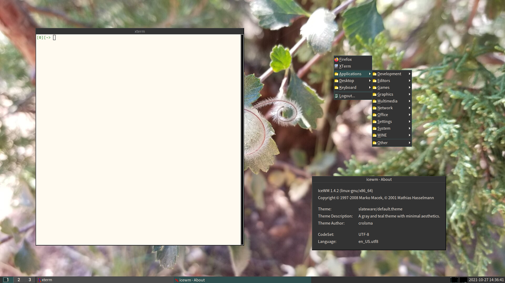

= IceWM Slateware Theme

A gray and teal theme with minimal aesthetics.
It started as only a predefined theme,
but the Makefile now allows for easy changes to the font and colors.

== Installation

`make [XDG_CONFIG_HOME=path] [attribute=value]`

Possible attributes are:

* `fontname`
* `fontsize`
* `background`
* `foreground`
* `highlight`
* `lowlight`
* `button`
* `monitor`

Consult the Makefile for default values.
